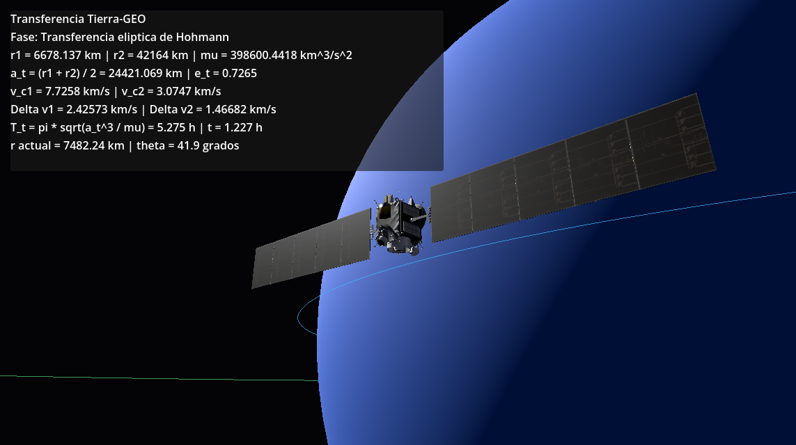

# hohmann-sim

Simulación y reporte sobre la robustez de una transferencia orbital de Hohmann
Tierra-GEO bajo incertidumbre en los impulsos.



## Objetivo

El proyecto estudia una transferencia de Hohmann desde una órbita baja terrestre
hasta una órbita geoestacionaria. En el caso ideal, la maniobra usa dos impulsos:
uno para entrar en una elipse de transferencia y otro para circularizar en la
órbita final.

El punto central del trabajo es medir qué tan confiable sigue siendo esa
maniobra cuando los impulsos no son perfectos. En una misión real puede haber
errores pequeños de empuje, navegación o orientación; por eso no basta con
calcular una trayectoria nominal. Hay que estimar cuántas ejecuciones plausibles
terminan realmente cerca de la órbita objetivo.

## Contenido

- `proyecto/proyecto.tex`: reporte escrito del modelo físico, la simulación
  numérica, el análisis Monte Carlo, los resultados y la visualización 3D.
- `proyecto/simular_hohmann.py`: código Python que calcula la transferencia,
  integra las órbitas, ejecuta Monte Carlo y genera las figuras.
- `proyecto/figures/`: figuras usadas en el reporte, incluyendo la captura de
  la simulación Godot.
- `sim/`: proyecto Godot 4 con una escena 3D de la Tierra, las órbitas, la
  elipse de transferencia y el satélite Dawn.

## Modelo Físico

La dinámica usa el problema restringido de dos cuerpos:

$\ddot{\mathbf r}=-\mu\mathbf r/|\mathbf r|^3$

Para el caso Tierra-GEO se usan:

- $\mu = 398600.4418\,\mathrm{km^3/s^2}$
- $r_1 = 6678.137\,\mathrm{km}$
- $r_2 = 42164\,\mathrm{km}$

Con esos valores, la transferencia ideal calculada en el reporte requiere:

- $\Delta v_1 = 2.42573\,\mathrm{km/s}$
- $\Delta v_2 = 1.46682\,\mathrm{km/s}$
- $T_t = 5.275\,\mathrm{h}$

Durante los tramos sin empuje se revisan energía mecánica específica y momento
angular específico. Esto sirve para verificar que los cambios observados vienen
de los impulsos perturbados y no de error dominante del integrador.

## Simulación Monte Carlo

El script `proyecto/simular_hohmann.py` repite la transferencia muchas veces.
En cada simulación se perturban los dos impulsos con errores aleatorios:

- error normal en la magnitud del impulso;
- error normal en la dirección tangencial.

Cada simulación representa una ejecución plausible de la maniobra: un motor que
entrega un poco más o menos velocidad, o una orientación ligeramente desviada
del vector tangencial ideal. Después del segundo impulso se calculan el semieje
mayor y la excentricidad de la órbita final.

Una simulación se considera exitosa si:

- $|a-r_2|/r_2<2\%$
- $e<0.02$

Este criterio es importante porque estar cerca de $r_2$ en un instante no
garantiza una órbita útil. Una trayectoria puede cruzar el radio objetivo, pero
quedar con demasiada energía o excentricidad y alejarse después. Monte Carlo
permite convertir esos errores pequeños de ejecución en una medida operacional:
la probabilidad de terminar en una órbita aceptable.

El reporte compara distintos niveles de incertidumbre. Con errores pequeños la
probabilidad de éxito permanece cerca de 1, pero al aumentar la dispersión de
los impulsos aparecen colas de la distribución que fallan por semieje mayor o
excentricidad fuera de tolerancia.

## Figuras Numéricas

El script Python genera:

- `orbitas.pdf`: órbita inicial, órbita objetivo, transferencia ideal y una
  transferencia perturbada.
- `probabilidad.pdf`: probabilidad de éxito contra incertidumbre del impulso.
- `histograma.pdf`: distribución del error relativo del semieje mayor final.

Para regenerarlas:

```bash
python proyecto/simular_hohmann.py
```

## Simulación Godot

La escena principal está en `sim/main.tscn` y ejecuta `sim/scripts/main.gd`.
La visualización no reemplaza el análisis Monte Carlo; muestra la maniobra
ideal de forma geométrica:

- órbita baja circular;
- media elipse de transferencia de Hohmann;
- órbita circular geoestacionaria;
- panel con $r_1$, $r_2$, $\mu$, $a_t$, $e_t$, $\Delta v_1$,
  $\Delta v_2$ y $T_t$.

La cámara orbita únicamente alrededor del satélite; se controla con arrastre
izquierdo y rueda del mouse.

Para abrirla:

```bash
godot --path sim
```

## Modelo 3D

El satélite usa el modelo Dawn publicado por NASA:
<https://science.nasa.gov/3d-resources/dawn/>

El GLB original viene comprimido con Draco, así que se guardó una versión
compatible con Godot en `sim/assets/models/Dawn_uncompressed.glb`.
